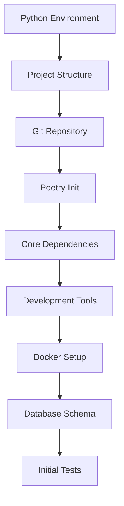

# Initial Setup Thoughts and Planning

## Overview
This document contains thoughts, decisions, and planning notes for the initial Freight project setup phase.

## Project Setup Priorities

### 1. Development Environment
- **Decision**: Use pyenv for Python version management (3.11+)
- **Rationale**: Ensures consistency across dev environments
- **Dependencies**: PostgreSQL 15+, Redis 7+, Node.js 18+ (for frontend)

### 2. Project Structure
```
freight/
├── api/                    # FastAPI application
│   ├── core/              # Core configuration
│   ├── models/            # SQLAlchemy models
│   ├── schemas/           # Pydantic schemas
│   ├── services/          # Business logic
│   ├── routers/           # API endpoints
│   └── middleware/        # Custom middleware
├── worker/                # Celery workers
│   ├── tasks/            # Task definitions
│   ├── retry/            # Retry logic
│   └── utils/            # Worker utilities
├── tests/                 # Test suite
│   ├── unit/
│   ├── integration/
│   └── fixtures/
├── infrastructure/        # Docker, configs
├── scripts/              # Utility scripts
└── docs/                 # Documentation
```

### 3. Version Control Strategy
- **Main Branch**: Protected, production-ready code
- **Develop Branch**: Integration branch for features
- **Feature Branches**: `feature/setup-*` for setup tasks
- **Commit Convention**: Conventional commits (feat, fix, chore, docs)

### 4. Dependency Management
- **Python**: Use Poetry for dependency management
- **Why Poetry**: 
  - Lock file for reproducible builds
  - Better dependency resolution
  - Virtual environment management
  - Easy packaging for deployment

### 5. Configuration Management
- **Environment Variables**: Use python-dotenv
- **Config Structure**: Pydantic BaseSettings for validation
- **Secrets**: Never commit, use .env.example as template

### 6. Testing Strategy
- **Framework**: pytest with plugins
- **Coverage Target**: 80% minimum for MVP
- **Test Categories**:
  - Unit: Fast, isolated component tests
  - Integration: Database, Redis, external API tests
  - E2E: Full workflow tests with Docker

### 7. Code Quality Tools
- **Linting**: Ruff (fast, comprehensive)
- **Formatting**: Black + isort
- **Type Checking**: mypy with strict mode
- **Pre-commit Hooks**: Enforce standards before commit

### 8. Documentation Standards
- **API Docs**: Auto-generated from FastAPI
- **Code Docs**: Google-style docstrings
- **Architecture Docs**: Mermaid diagrams in Markdown
- **README**: Comprehensive setup and usage guide

## Setup Task Dependencies



## Risk Mitigation

1. **Database Migrations**: Set up Alembic early to avoid schema drift
2. **Multi-tenancy**: Design with tenant isolation from day one
3. **Secrets Management**: Establish pattern before any sensitive data
4. **Monitoring**: Add basic logging/metrics from the start

## Open Questions

1. Should we use SQLAlchemy 2.0 with async support?
2. Redis connection pooling strategy for high concurrency?
3. Celery vs. Dramatiq for task queue (Celery is proven but complex)?
4. Authentication: Simple API keys vs. JWT from start?

## Next Steps

1. Create project structure
2. Initialize Poetry and add core dependencies  
3. Set up pre-commit hooks
4. Create initial database models
5. Implement basic health check endpoint

## Notes

- Consider using Pydantic v2 for better performance
- FastAPI 0.100+ has better WebSocket support if needed later
- Keep initial setup minimal but extensible
- Document all setup decisions for future team members